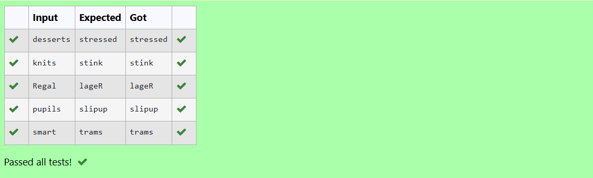

# EX 1A Reverse a String
## DATE: 
## AIM:
To write a program to create a recursive function to reverse a string.

## Algorithm
1. Take input string s.
2. If length of s is 0 or 1, return s (base case). 
3. Otherwise, recursively call the function with s[1:].
4. Append s[0] to the result of the recursive call.
5. Return the final reversed string.

## Program:
Developed by: SHAKTHI KUMAR S
Register Number: 212222110043
```python

def reverse_string(s):
    if len(s) <= 1:  
        return s
    else:
        return reverse_string(s[1:]) + s[0]  


input_string = input()
reversed_string = reverse_string(input_string)
print(reversed_string) 
```

## Output:



## Result:
The program successfully reverses the input string using recursion. When the user provides an input string, the output displays the reversed version of the string
