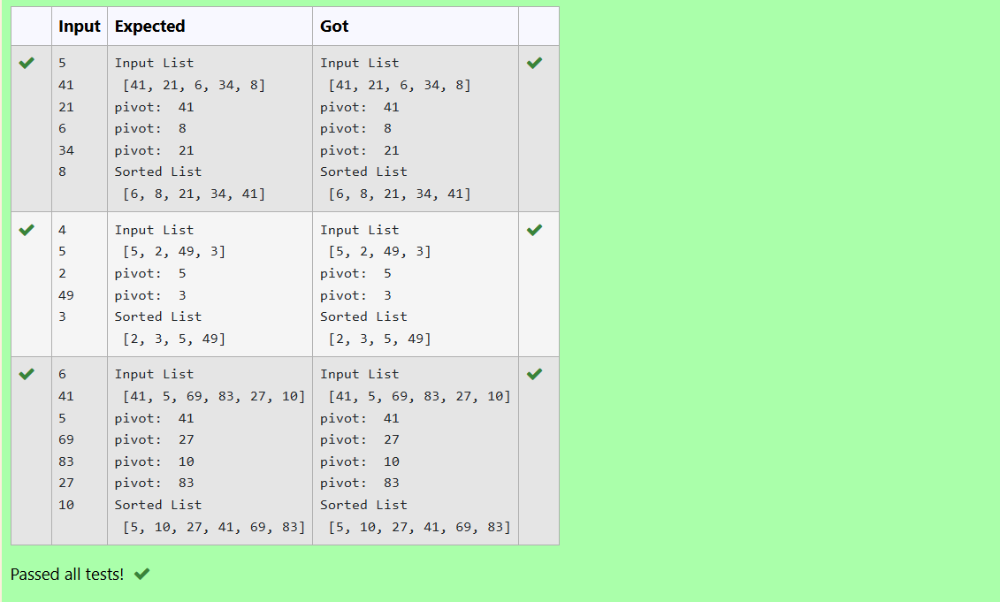

# EX 1C Quick Sort
## DATE:
## AIM:
To write a python program to implement quick sort using tha last element as pivot on the list of float values.

## Algorithm
1. If the array has more than one element, split it into two halves.
2. Recursively apply merge sort on both halves.
3. Compare elements of both halves and merge them into a sorted array.
4. Copy any remaining elements from the left or right half.
5. Return the fully sorted array.
   

## Program:
Developed by: SHAKTHI KUMAR S

Register Number: 212222110043
```python
def partition(array, low, high):
    pivot = array[low]
    start = low + 1
    end = high
    print("pivot: ",pivot)
    while True:
        while start <= end and array[end] >= pivot:
            end = end - 1
        while start <= end and array[start] <= pivot:
            start = start + 1
        if start <= end:
            array[start], array[end] = array[end], array[start]
        else:
            break
    array[low], array[end] = array[end], array[low]
    return end
def quick_sort(array, start, end):
    if start < end:
        idx = partition(array, start, end)
        quick_sort(array, start, idx-1)
        quick_sort(array, idx+1, end)
arr1=[]
n=int(input())
for i in range(n):
    arr1.append(int(input()))
print("Input List\n",arr1)
quick_sort(arr1, 0, len(arr1)-1)
print("Sorted List\n",arr1)
 
```

## Output:



## Result:
The program successfully sorts the input array using the QuickSort algorithm, arranging the elements in ascending order.
